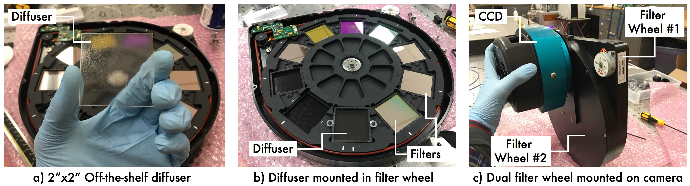

# About Diffusers
Diffusers can be most easily installed in a telescope by putting them in a dual filter wheel. This makes it easy to change between diffused and non-diffused observations (useful to find the field and focus), and to choose which filter to pair with the diffuser. The figure below gives an example of a diffuser in a dual filter wheel. 

The following video compares defocused and diffused PSFs.

The defocused PSF is irregular and changes with seeing and other atmospheric effects, while the diffused PSF is stable throughout the night.

<iframe width="720" height="415" src="https://www.youtube.com/embed/U6cv1_-qA0o" frameborder="0" allow="autoplay; encrypted-media" allowfullscreen></iframe>

## Further reading
Further reading about diffusers for precision photometry applications can be found in the following papers:

- [Paper I](https://arxiv.org/abs/1710.01790)
- [Paper II](https://arxiv.org/abs/1807.04420)
