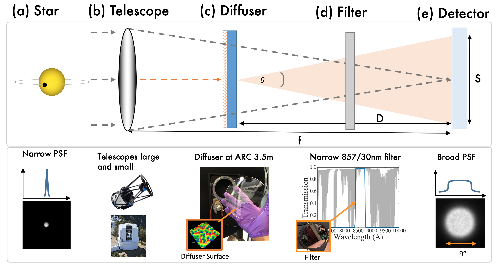

<script type="text/javascript" async src="https://cdnjs.cloudflare.com/ajax/libs/mathjax/2.7.4/MathJax.js?config=TeX-MML-AM_CHTML" async>
</script>

# Sizing Diffusers

`iDiffuse` provides two ways to calculate the expected Full Width at Half Maximum size of a given diffuser on the focal plane:

1. On-line calculator below.
2. Python function as part of `iDiffuse`

Both calculators use the following equation, 
$$S = \tan(\theta) D,$$
where \\(S\\) is the FWHM of the diffused PSF, \\(D\\) is the optical distance of the diffuser from the focal plane, and \\(\theta\\) is the opening angle of the diffuser as defined in the following figure:




## Online Calculator
The following online calculator calculates the expected Point Spread Function (PSF) size of an Engineered Diffuser in a converging / collimated beam, returning the Full-Width-at-Half-Maximum (FWHM) of the resulting top-hat PSF.

Notes:

- Assumes a top-hat PSF
- Distance from the detector should be the optical distance, i.e., it assumes this has accounted for the optical thickness (thickness times the index of refraction of a glass) of the materials
- This equation is valid to first order. For more thorough analyzis, we suggest full non-sequential optical modeling in Zemax. RPC Photonics makes this easy as they provide the as-measured scattering BSDF files freely online [https://www.rpcphotonics.com/bsdf-data-optical-diffusers/](here) 

<link rel="stylesheet" href="https://stackpath.bootstrapcdn.com/bootstrap/4.1.1/css/bootstrap.min.css" integrity="sha384-WskhaSGFgHYWDcbwN70/dfYBj47jz9qbsMId/iRN3ewGhXQFZCSftd1LZCfmhktB" crossorigin="anonymous">
<script src="https://stackpath.bootstrapcdn.com/bootstrap/4.1.1/js/bootstrap.min.js" integrity="sha384-smHYKdLADwkXOn1EmN1qk/HfnUcbVRZyYmZ4qpPea6sjB/pTJ0euyQp0Mk8ck+5T" crossorigin="anonymous"></script>

<form id="diffuserform" action="">
<fieldset>
	<h4>Calculating Expected Diffuser PSF FWHM</h4>
	<div class='form-group row'>
	   <label for="angle" class="col-sm-4 col-form-label">Opening Angle (deg):</label>
             <div class="col-sm-3">
	       <input id="angle" name="angle" type='number' step='0.001' min='0' value="0.34"/>
	    </div>
	</div>
	<div class='form-group row'>
  	   <label for="distance" class="col-sm-4 col-form-label">Diffuser-to-detector distance (mm):</label>
             <div class="col-sm-3">
		<input id="distance" name="distance" type='number' step='0.1' min='0' value='200' />
	    </div>
	</div>
	<p>
	<div class='form-group row'>
  	   <label for="pixelsize" class="col-sm-4 col-form-label">Pixel Size (micron):</label>
             <div class="col-sm-3">
		<input id="pixelsize" name="pixelsize" type='number' step='0.01' min='0' value='15' />
	    </div>
	</div>
	<p>
	<div class='form-group row'>
  	   <label for="platescale" class="col-sm-4 col-form-label">Plate Scale ("/pix):</label>
             <div class="col-sm-3">
		<input id="platescale" name="platescale" type='number' step='0.001' min='0' value='0.11' />
	    </div>
	</div>
	<p>
		<input class="btn btn-outline-primary" type="submit" value="Calculate" />
		or
		<input class="btn btn-outline-primary" type="reset" value="Reset" />
	</p>
	<p class="font-weight-bold">NOTE: Distance is optical length (i.e., weighted by the index of refraction).</p>
	<p class="font-weight-bold">Default values are values for the ARCTIC/diffuser system</p>
	<div class='form-group row'>
	   <label id='fwhm_pix_input' for="fwhm_pix" class="col-sm-4 col-form-label">Diffused PSF FWHM (pix):</label>
             <div class="col-sm-3">
	       <input id="fwhm_pix" name="fwhm_pix" placeholder="0" readonly/>
	     </div>
	</div>
	<div class='form-group row'>
	   <label id='fwhm_arcsec_input' for="fwhm_arcsec" class="col-sm-4 col-form-label">Diffused PSF FWHM ("):</label>
             <div class="col-sm-3">
	       <input id="fwhm_arcsec" name="fwhm_arcsec" placeholder="0" readonly/>
	     </div>
	</div>
</fieldset>
</form>

<script>
(function () {
	function getTanFromDegrees(degrees) {
		return ( Math.tan(degrees * Math.PI / 180) );
	}

	function get_diffused_FWHM(angle, distance, pixelsize, platescale) {
		// Calculate diffuser FWHM
		// INPUT:
		//    angle in degrees
		//    distance in mm
		//    pixelsize in microns
		//    platescale in arcsec / pix
		// OUTPUT:
		//    FWHM in pixels
		angle = parseFloat(angle);
		distance = parseFloat(distance);
		pixelsize = parseFloat(pixelsize);
		platescale = parseFloat(platescale);
		fwhm_in_pix = 2*getTanFromDegrees(angle/2)*distance/(pixelsize/1000);
		return ( parseFloat(fwhm_in_pix).toFixed(2) );
	}

	var diffuserForm = document.getElementById("diffuserform");
	if (diffuserForm) {
		diffuserForm.onsubmit = function () {
			fwhm_pix = get_diffused_FWHM(this.angle.value,this.distance.value,this.pixelsize.value,this.platescale.value);
			fwhm_arcsec = fwhm_pix * this.platescale.value ;
			this.fwhm_pix.value = fwhm_pix;
			this.fwhm_arcsec.value = parseFloat(fwhm_arcsec).toFixed(2);
			return false;
		};
	}
}());
</script>


## Python Function

Additionally `iDiffuse` provides a simple Python function that performs the same calculation as in the online calculator above.

This function can be used in the following way:

```
from idiffuse import diffuser
plt_scale = 0.11 # arcsec/pix
fwhm_pix = diffuser.calculate_diffuser_fwhm(opening_angle=0.34,         # deg
                                            distance_from_detector=200, # mm
                                            pix_size=15)              # pixels
fwhm_arcsec = fwhm_pix * plt_scale
print('FWHM in pixels: {:0.3f}'.format(fwhm_pix))
print('FWHM in arcsec: {:0.3f}'.format(fwhm_arcsec))
```
which gives the following output:
```
FWHM in pixels: 79.122
FWHM in arcsec: 8.703
```
