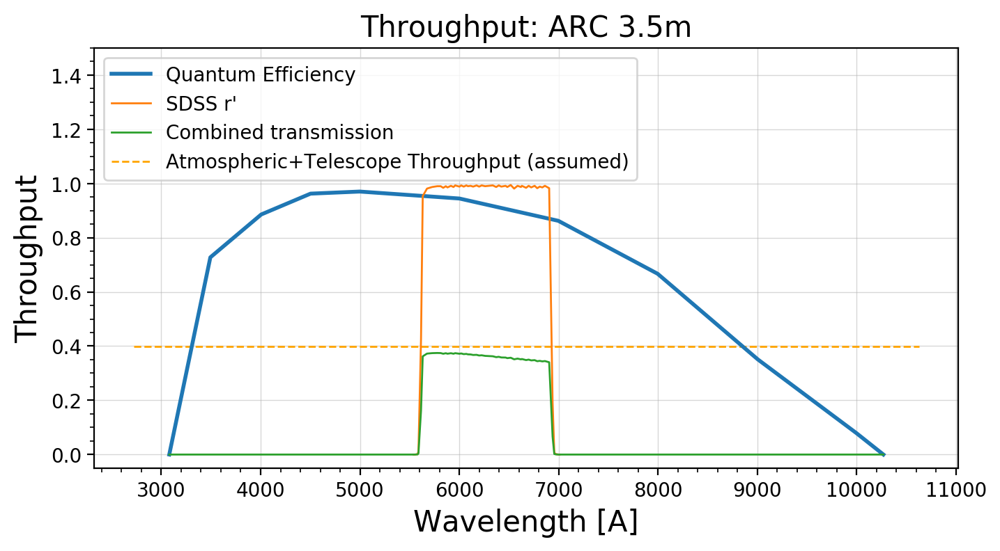
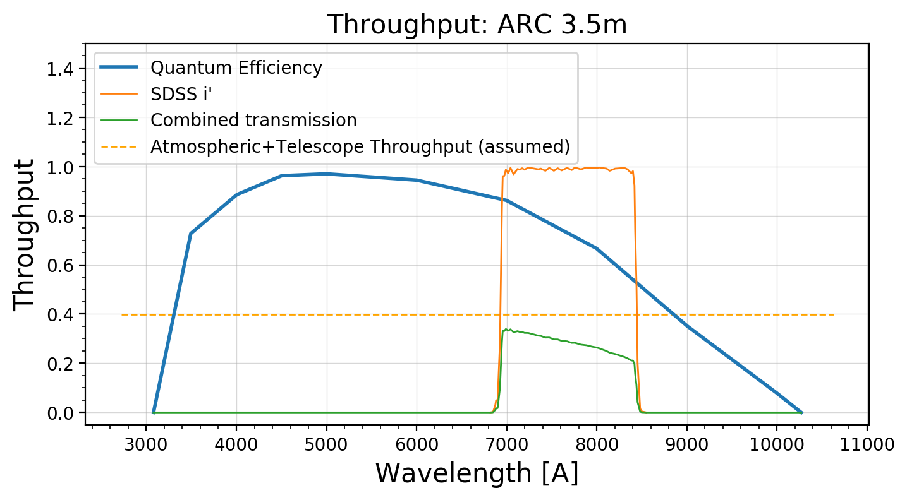

# Getting Started

## Using `iDiffuse` to calculate expected photometric precisions

### Import necessary packages


```python
from __future__ import print_function
import numpy as np
import pandas as pd
import idiffuse
import pysynphot as S
# if pysynphot says:
# - UserWarning: PYSYN_CDBS is undefined; functionality will be SEVERELY crippled.
# then idiffuse should still work.
# You can set the PYSYN_CDBS by following the pysynphot installation instructions here:
# https://pysynphot.readthedocs.io/en/latest/#installation-and-setup
```

# Initialize Telescope Class that implements the ARC 3.5m at APO
Also correctly sets up the diffuser in ARCTIC (0.34 deg opening angle, at a distance of 200mm)


```python
arc = idiffuse.telescope.TelescopeARC()
```


```python
# Print descriptive text about the telescope
print(arc)
```

    Telescope: 			        	ARC 3.5m
    Throughput (flat) (%): 			39.838
    Diameter (cm):		        	350.000
    Fnum:             				8.000
    Focal length (m): 				28.000
    Gain:                 			2.000
    Pixel size (um): 				15.000
    Num pixels: 		        	4096.000
    Plate scale (arcsec/pix):		0.110
    FOV (arcmin): 		        	7.509
    Dark Noise (e/s/pix): 			0.000
    Read Noise (e/pix):   			3.700
    Altitude (m):   				2788.000
    Central Obstruction (%): 		9.000
    Diffuser dist to detector (mm):	200.000
    11 available filters in folder:	/Users/gks/Dropbox/mypylib/notebooks/GIT/idiffuse/idiffuse/filters
    

The arc object has an attribute to list the available filters.
These are also accessible through the arc.FILT_DICT dictionary.
```python
arc.get_filter_filenames()
```


    ['/Users/gks/Dropbox/mypylib/notebooks/GIT/idiffuse/idiffuse/filters/arctic_qe.txt',
     '/Users/gks/Dropbox/mypylib/notebooks/GIT/idiffuse/idiffuse/filters/bess-b.txt',
     '/Users/gks/Dropbox/mypylib/notebooks/GIT/idiffuse/idiffuse/filters/bess-i.txt',
     '/Users/gks/Dropbox/mypylib/notebooks/GIT/idiffuse/idiffuse/filters/bess-r.txt',
     '/Users/gks/Dropbox/mypylib/notebooks/GIT/idiffuse/idiffuse/filters/bess-u.txt',
     '/Users/gks/Dropbox/mypylib/notebooks/GIT/idiffuse/idiffuse/filters/bess-v.txt',
     '/Users/gks/Dropbox/mypylib/notebooks/GIT/idiffuse/idiffuse/filters/semrock_857_30.txt',
     '/Users/gks/Dropbox/mypylib/notebooks/GIT/idiffuse/idiffuse/filters/sloan_g_filter.txt',
     '/Users/gks/Dropbox/mypylib/notebooks/GIT/idiffuse/idiffuse/filters/sloan_i_filter.txt',
     '/Users/gks/Dropbox/mypylib/notebooks/GIT/idiffuse/idiffuse/filters/sloan_r_filter.txt',
     '/Users/gks/Dropbox/mypylib/notebooks/GIT/idiffuse/idiffuse/filters/sloan_z_filter.txt']


### Plot Telescope QE / Throughput plot for given filters
We can plot the throughput of the different filters used, and compare them to the Quantum Efficiency of the ARCTIC detector.

```python
# use FILT_DICT dictionary
ifilt = S.FileBandpass(arc.FILTER_DICT['sloan_i_filter.txt'])
rfilt = S.FileBandpass(arc.FILTER_DICT['sloan_r_filter.txt'])

arc.plot_throughput(bandpass=rfilt,bandpass_name="SDSS r'")
arc.plot_throughput(bandpass=ifilt,bandpass_name="SDSS i'")
```








# Example on-sky diffuser assisted precision 
Below are examples of how to calculate the expected photometric error and the resulting cadence for on-sky observations of a given target. In Stefansson et al. 2018, we compare these expected precision values to the on-sky achieved precision.  

### K2-28b

```python
err, cad = arc.get_err_cad_for_adu(vegamag=13.8,
                        BandPass=ifilt,
                        binning=4,
                        max_adu_per_pixel=2800.,
                        read_time=2.7,
                        airmass=1.3,
                        num_ref_stars=3.,
                        sky_mag_per_arcsec=19.7)
```

    ##### Exptime #####
    Exptime [s]:                  29.954
    Total cadence [s]:            32.654
    Obs. Efficiency [%]:          91.73
    npix [pix]:                   307.30
    n_b [pix]:                    537.77
    
    ##### Counts #####
    Star counts - Total [adu]:    860439.86 
    Star counts - /pix [adu/pix]: 2800.00 
    Sky counts - Total [adu]:     223454.12
    Sky counts - /pix [adu/pix]:  727.15
    
    ##### Noise in exptime=29.95s ######
    Photometric noise [ppm]       1045.96
    Photon noise [ppm]:           880.23
    Scintillation noise [ppm]:    452.96
    Total noise [ppm]:            1139.83
    
    ##### Noise ######
    Noise in 1min [ppm]:          840.88
    Noise in 30min [ppm]:         153.52
    #####


## TRES-3b

```python
err, cad = arc.get_err_cad_for_adu(vegamag=11.2,
                        BandPass=ifilt,
                        binning=4,
                        max_adu_per_pixel=27000.,
                        read_time=2.7,
                        airmass=1.2,
                        num_ref_stars=13.,
                        sky_mag_per_arcsec=19.7)
```

    ##### Exptime #####
    Exptime [s]:                  26.343
    Total cadence [s]:            29.043
    Obs. Efficiency [%]:          90.70
    npix [pix]:                   307.30
    n_b [pix]:                    537.77
    
    ##### Counts #####
    Star counts - Total [adu]:    8297098.66 
    Star counts - /pix [adu/pix]: 27000.00 
    Sky counts - Total [adu]:     196514.27
    Sky counts - /pix [adu/pix]:  639.49
    
    ##### Noise in exptime=26.34s ######
    Photometric noise [ppm]       259.50
    Photon noise [ppm]:           254.75
    Scintillation noise [ppm]:    377.35
    Total noise [ppm]:            457.97
    
    ##### Noise ######
    Noise in 1min [ppm]:          318.63
    Noise in 30min [ppm]:         58.17
    #####


## WASP-85 A b


```python
err, cad = arc.get_err_cad_for_adu(vegamag=10.0,
                        BandPass=rfilt,
                        binning=4,
                        max_adu_per_pixel=20000.,
                        read_time=2.7,
                        airmass=1.3,
                        num_ref_stars=3.,
                        sky_mag_per_arcsec=19.7)
```

    ##### Exptime #####
    Exptime [s]:                  3.896
    Total cadence [s]:            6.596
    Obs. Efficiency [%]:          59.07
    npix [pix]:                   307.30
    n_b [pix]:                    537.77
    
    ##### Counts #####
    Star counts - Total [adu]:    6145999.01 
    Star counts - /pix [adu/pix]: 20000.00 
    Sky counts - Total [adu]:     48201.48
    Sky counts - /pix [adu/pix]:  156.85
    
    ##### Noise in exptime=3.90s ######
    Photometric noise [ppm]       331.46
    Photon noise [ppm]:           329.35
    Scintillation noise [ppm]:    1255.93
    Total noise [ppm]:            1298.94
    
    ##### Noise ######
    Noise in 1min [ppm]:          430.69
    Noise in 30min [ppm]:         78.63
    #####


## K2-100b 


```python
err, cad = arc.get_err_cad_for_adu(vegamag=10.0,
                        BandPass=ifilt,
                        binning=4,
                        max_adu_per_pixel=23000.,
                        read_time=2.7,
                        airmass=1.05,
                        num_ref_stars=10.,
                        sky_mag_per_arcsec=19.7)
```

    ##### Exptime #####
    Exptime [s]:                  7.431
    Total cadence [s]:            10.131
    Obs. Efficiency [%]:          73.35
    npix [pix]:                   307.30
    n_b [pix]:                    537.77
    
    ##### Counts #####
    Star counts - Total [adu]:    7067898.86 
    Star counts - /pix [adu/pix]: 23000.00 
    Sky counts - Total [adu]:     55431.70
    Sky counts - /pix [adu/pix]:  180.38
    
    ##### Noise in exptime=7.43s ######
    Photometric noise [ppm]       280.74
    Photon noise [ppm]:           278.96
    Scintillation noise [ppm]:    568.44
    Total noise [ppm]:            633.98
    
    ##### Noise ######
    Noise in 1min [ppm]:          260.51
    Noise in 30min [ppm]:         47.56
    #####

